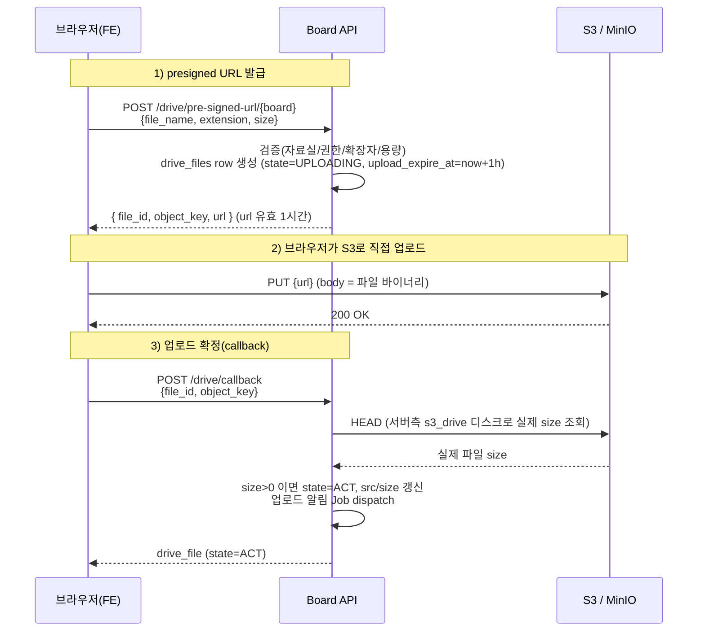

# Drive 업로드 · 부서(조직도) · Live API

> 대상: 프론트엔드. 모든 내용은 실제 소스코드(`S3UploadController`, `DepartmentController`, `LiveController`, `ReturnCode`, `config/filesystems.php`, 라우트/모델)를 직접 읽고 정리했습니다.

## 0. 공통 사항

| 항목 | 값 |
| --- | --- |
| Base URL(로컬) | `http://localhost:8000` |
| 공통 prefix | `/api/v1` |
| 인증 | `auth:api` (Laravel Passport, Bearer 토큰) — 아래 6개 엔드포인트 전부 필수 |
| 로케일 | `locale.set` 미들웨어 |

### 요청 헤더

| 헤더 | 필수 | 설명 |
| --- | --- | --- |
| `Authorization` | O | `Bearer <access_token>` |
| `Lang` | X | `ko`(기본) / `en` / `ja`. 에러 메시지 로케일 결정 (헤더 키는 `Lang`) |
| `Time_zone` | X | 기본 `Asia/Seoul` |

- 현재 유저는 토큰으로 식별되며 대부분 로직이 **해당 유저의 `company_id` 스코프**로 동작합니다.
- 업로드 계열은 라우트가 `.../drive/...` 아래에 있고, 대상 게시판은 path의 `{board}`(라우트 모델 바인딩)로 지정합니다. 존재하지 않는 board/파일 id → **404**.

### 에러 응답 형식 (ReturnCode)

실패 응답은 전부 `ReturnCode::customResponse` 또는 `ReturnCode::validationCheck`로 생성되며 형태는 동일합니다.

```json
{ "message": "사람이 읽을 메시지", "code": 501 }
```

| 필드 | 설명 |
| --- | --- |
| `message` | 에러 메시지(로케일/검증 결과에 따라 달라짐). **검증 실패 시 Laravel validator의 첫 번째 에러 메시지** |
| `code` | 선택. `APP_ERROR_CODE_DEBUG` 환경에서만 검증 타입 코드(예: `501`)가 붙음. 평소엔 없을 수 있음 |

HTTP status 매핑: `400` 잘못된 요청/검증 실패, `403` 권한 없음, `404` 리소스 없음, `500` 서버 오류.

> ⚠️ **주의(중요):** 드라이브 검증 메시지 중 `exceeded_size_per_file`(파일당 용량 초과)와 `not_allow_extension`(금지 확장자)는 lang 파일(ko/en/ja 공통)에 번역이 안 되어 있어 **메시지가 키 문자열 그대로**(`"exceeded_size_per_file"`, `"not_allow_extension"`) 내려옵니다. 반면 `not_enough_drive_capacity`, `is_not_drive`(`자료실이 아닙니다.`), `no_permission`(`권한이 없습니다.`)는 번역됨. → 프론트는 `message` 문자열이 아니라 **상황/HTTP status로 분기**하세요.

---

## 1. 파일 업로드 3단계 흐름 (presign → PUT → callback)

파일은 서버를 거치지 않고 **브라우저가 S3(로컬은 MinIO)로 직접 PUT** 합니다. 서버는 (1) presigned URL 발급, (3) 업로드 확정만 담당합니다.



### 흐름 핵심 포인트

- **2단계 PUT**: 응답의 `url`로 파일 원본을 그대로 `PUT` 합니다. 이 URL은 SigV4 서명이 쿼리스트링에 포함되어 있어 별도 `Authorization` 헤더가 필요 없습니다. **유효기간 1시간**(발급 시각 + 1h). 만료 후 PUT 시 S3가 서명 만료로 거부합니다.
- **presign 대상 엔드포인트(로컬 vs 운영)**:
  - 로컬(`.env.local`에 `AWS_PUBLIC_ENDPOINT`=`http://localhost:9100` 설정): 브라우저가 닿을 수 있는 공개 엔드포인트(MinIO)로 서명 → 반환 `url`이 `http://localhost:9100/...`.
  - 운영(`AWS_PUBLIC_ENDPOINT` 미설정): 실제 AWS로 서명(기존 동작).
- **object_key 형식**: `{AWS_DRIVE_FOLDER}/{file_id}/{timestamp}.{extension}` (버킷 = `AWS_DRIVE_BUCKET`).
- **callback의 size 검증**: 서버는 클라이언트가 보낸 size가 아니라, `s3_drive` 디스크(실 AWS/`AWS_ENDPOINT`)로 **실제 업로드된 크기를 다시 조회**해 `drive_files.size`에 덮어씁니다. 즉 presign 때의 size는 사전 검증용이고, 확정 size는 callback에서 결정됩니다.
- **미확정 파일**: presign만 하고 PUT/callback을 안 하면 row는 `UPLOADING` 상태로 남습니다(`upload_expire_at` = 발급+1h). 확정(ACT)돼야 실제 목록에 노출됩니다.

---

## 2. POST `/api/v1/drive/pre-signed-url/multiple/{board}` — 다중 presign 발급

`S3UploadController::getMultiplePreSignedUrl`

| 항목 | 내용 |
| --- | --- |
| ① Method/URL | `POST /api/v1/drive/pre-signed-url/multiple/{board}` |
| ② Path | `board` = 대상 게시판 id (없으면 404) |
| ③ Query | 없음 |
| ⑤ 인증/권한 | Bearer 필수. 대상 board에 **write 권한** 필요(없으면 403). 공개 게시판은 read/write 자동 허용, 그 외는 관리자/카테고리/게시판 멤버·부서 권한으로 판정 |

### ④ Body

| 필드 | 타입 | 필수 | 설명 |
| --- | --- | --- | --- |
| `files` | array | O | 파일 배열. **최대 10개** |
| `files[].file_name` | string | O | 원본 파일명 |
| `files[].extension` | string | O | 확장자(점 제외, 예: `pdf`) |
| `files[].size` | int | O | 바이트 |
| `drive_folder_id` | string | X | (최상위 optional) 저장할 드라이브 폴더 id |

```json
{
  "drive_folder_id": "0f...(선택)",
  "files": [
    { "file_name": "설계서.pdf", "extension": "pdf", "size": 1048576 },
    { "file_name": "사진.jpg",   "extension": "jpg", "size": 5242880 }
  ]
}
```

### 검증 순서

1. body 검증(위 규칙) 실패 → **400**
2. `board.is_drive == false` → **400** (`자료실이 아닙니다.`)
3. **write 권한** 없음 → **403** (`권한이 없습니다.`)
4. 이후 파일별 루프(아래) — 여기서는 abort 하지 않고 **파일별 `result.state=fail`로만 표기**

파일별 검증(각 파일 독립, 실패해도 다음 파일 계속):

- 금지 확장자(`board.except_extension`, 대소문자 무시) → `result: {state:"fail", message:"not_allow_extension"}`
- 파일당 용량 초과 → `result: {state:"fail", message:"exceeded_size_per_file"}`
  - `size_limit_per_file > 0`이면 그 값과 비교, 아니면 전역 `MAX_FILE_SIZE = 3221225472`(3GiB)와 비교
- 자료실 잔여 용량 부족 → `result: {state:"fail", message:"not_enough_drive_capacity"}`
  - `size_limit > 0`일 때만 적용. 잔여 = `size_limit - (해당 board의 ACT 파일 size 합)`, 파일마다 차감

성공 파일만 `drive_files` row(state=UPLOADING, expire=now+1h)를 트랜잭션 내에서 생성합니다.

### ⑥ Response (200)

입력 `files` 배열을 그대로 되돌려주되 각 원소에 `result`가 추가됩니다. **HTTP는 항상 200** (일부/전부 실패해도 200).

```json
[
  {
    "file_name": "설계서.pdf", "extension": "pdf", "size": 1048576,
    "result": {
      "state": "success",
      "file_id": "9d1f...",
      "object_key": "drive/9d1f.../1724650000.pdf",
      "url": "http://localhost:9100/<bucket>/drive/9d1f.../1724650000.pdf?X-Amz-..."
    }
  },
  {
    "file_name": "사진.jpg", "extension": "jpg", "size": 5242880,
    "result": { "state": "fail", "message": "exceeded_size_per_file" }
  }
]
```

### ⑦ 주의사항

- 성공/실패는 **배열 각 원소의 `result.state`로 판단**(HTTP status 아님).
- 성공 항목의 `file_id`/`object_key`는 3단계 callback에 그대로 사용.
- 파일 배열 11개 이상 → 400.
- ⚠️ **잔여 용량 로직 함정**: 잔여 용량 검사는 `잔여 > 0`일 때만 수행됩니다. 이미 `size_limit`을 꽉 채웠거나(잔여 ≤ 0) 직전 파일로 잔여가 정확히 0이 되면, 이후 파일의 용량 검사가 **건너뛰어져 통과**할 수 있습니다(단일 엔드포인트와 다름). 총량 초과를 엄격히 막아야 하면 단일 endpoint를 쓰거나 서버 수정 필요.

### ⑧ 시나리오

| 상황 | 결과 |
| --- | --- |
| 정상(모두 OK) | 200, 모든 원소 `result.state="success"` |
| 일부 용량 초과 | 200, 해당 원소만 `fail/exceeded_size_per_file`, 나머지 success |
| 금지 확장자 포함 | 200, 해당 원소만 `fail/not_allow_extension` |
| write 권한 없음 | 403 `권한이 없습니다.` (배열 전체 발급 안 됨) |
| board가 자료실 아님 | 400 `자료실이 아닙니다.` |

---

## 3. POST `/api/v1/drive/pre-signed-url/{board}` — 단일 presign 발급

`S3UploadController::getPreSignedUrl`

| 항목 | 내용 |
| --- | --- |
| ① Method/URL | `POST /api/v1/drive/pre-signed-url/{board}` |
| ② Path | `board` = 대상 게시판 id (없으면 404) |
| ③ Query | 없음 |
| ⑤ 인증/권한 | Bearer 필수 + 대상 board **write 권한**(없으면 403) |

### ④ Body

| 필드 | 타입 | 필수 | 설명 |
| --- | --- | --- | --- |
| `file_name` | string | O | 원본 파일명 |
| `extension` | string | O | 확장자(점 제외) |
| `size` | int | O | 바이트 |
| `drive_folder_id` | string | X | 저장할 드라이브 폴더 id |

```json
{ "file_name": "설계서.pdf", "extension": "pdf", "size": 1048576 }
```

### 검증 순서 (다중과 달리 하나라도 걸리면 즉시 abort)

1. body 검증 실패 → **400**
2. `is_drive == false` → **400** (`자료실이 아닙니다.`)
3. 금지 확장자 → **400** (`not_allow_extension`) — *권한 검사보다 먼저 수행됨*
4. **write 권한** 없음 → **403** (`권한이 없습니다.`)
5. 파일당 용량 초과 → **400** (`exceeded_size_per_file`) — 기준은 다중과 동일(`size_limit_per_file` 또는 3GiB)
6. 자료실 총량 초과(`size_limit > 0`이고 `기존 ACT 합 + size > size_limit`) → **400** (`not_enough_drive_capacity`)

### ⑥ Response (200)

```json
{
  "file_id": "9d1f...",
  "object_key": "drive/9d1f.../1724650000.pdf",
  "url": "http://localhost:9100/<bucket>/drive/9d1f.../1724650000.pdf?X-Amz-..."
}
```

### ⑦ 주의사항

- `url` 유효기간 1시간. 만료 시 재발급 필요.
- 발급 시점에 `drive_files` row(UPLOADING)가 생성됨. callback 없이는 목록 미노출.

### ⑧ 시나리오

| 상황 | 결과 |
| --- | --- |
| 정상 | 200 `{file_id, object_key, url}` |
| 용량 초과(파일당/총량) | 400 (`exceeded_size_per_file` / `not_enough_drive_capacity`) |
| 금지 확장자 | 400 `not_allow_extension` |
| write 권한 없음 | 403 `권한이 없습니다.` |

---

## 4. POST `/api/v1/drive/callback` — 업로드 확정

`S3UploadController::uploadCallback`

| 항목 | 내용 |
| --- | --- |
| ① Method/URL | `POST /api/v1/drive/callback` |
| ② Path | 없음 |
| ③ Query | 없음 |
| ⑤ 인증/권한 | Bearer 필수. **별도 board 권한 검사 없음**(아래 주의) |

### ④ Body

| 필드 | 타입 | 필수 | 설명 |
| --- | --- | --- | --- |
| `file_id` | string | O | presign 응답의 file_id |
| `object_key` | string | O | presign 응답의 object_key |

```json
{ "file_id": "9d1f...", "object_key": "drive/9d1f.../1724650000.pdf" }
```

### 동작

1. `file_id`로 `drive_files` 조회(없으면 **404**).
2. 상태가 `UPLOADING`일 때만 처리(그 외 상태면 그대로 반환 = **멱등**).
3. `s3_drive` 디스크로 `object_key`의 실제 size 조회.
4. `size > 0`이면 `src=object_key`, `size=실제값`, `state=ACT`로 저장하고 **업로드 알림 Job(`ProcessUploadAlarm`) dispatch**(board `is_post_alarm`일 때 board 멤버에게 push).

### ⑥ Response (200)

`drive_files` 모델 전체를 반환(확정 시 `state="ACT"`). `is_bookmark` 등 append 속성 포함.

### ⑦ 주의사항

- S3에서 size 조회 실패(객체 없음/PUT 미완료 등) → **500**. → 반드시 2단계 PUT이 `200`을 받은 뒤 호출하세요.
- `size == 0`이거나 이미 `ACT` 상태면 아무 변화 없이 200 반환(상태 그대로). 확정 여부는 응답의 `state`로 확인.
- ⚠️ **권한/소유 검증 없음**: callback은 board 권한이나 "이 파일이 내 것인지"를 확인하지 않습니다. 유효한 `file_id`+`object_key`만 있으면 확정됩니다. 또한 `object_key`가 해당 파일의 실제 키와 일치하는지도 검사하지 않으므로 프론트는 presign 응답값을 **변형 없이 그대로** 전달해야 합니다.

### ⑧ 시나리오

| 상황 | 결과 |
| --- | --- |
| 정상(PUT 완료 후) | 200, `state="ACT"` |
| PUT 전에 호출/객체 없음 | 500 |
| 이미 확정된 파일 재호출 | 200, 변화 없음(멱등) |
| 없는 file_id | 404 |

---

## 5. GET `/api/v1/department` — 내 회사 조직도

`DepartmentController::selectDepartmentForUserCompanyId` → 내부적으로 `getDepartmentTree($request, 내 company_id)` 호출.

| 항목 | 내용 |
| --- | --- |
| ① Method/URL | `GET /api/v1/department` |
| ② Path | 없음 |
| ③ Query | `category_id` (선택) — 지정 시 해당 카테고리에 속한 멤버/부서만 필터 |
| ④ Body | 없음 |
| ⑤ 인증/권한 | Bearer 필수. 대상 회사 = **현재 유저의 company_id 고정**(임의 회사 조회 불가) |

⑥⑦⑧은 6번(`getDepartmentTree`)과 동일 — 아래 참조.

---

## 6. GET `/api/v1/department/{companyId}` — 특정 회사 조직도 트리

`DepartmentController::getDepartmentTree`

| 항목 | 내용 |
| --- | --- |
| ① Method/URL | `GET /api/v1/department/{companyId}` |
| ② Path | `companyId` = 조회 대상 회사 id (정수) |
| ③ Query | `category_id` (선택) |
| ④ Body | 없음 |
| ⑤ 인증/권한 | Bearer 필수 |

> **데이터 소스**: 부서/멤버는 `officewave` DB(`public.departments`, `public.members`)에서 조회됩니다. breadcrumbs는 `department_closure`(폐포 테이블)로 계산.

### ⑥ Response (200) — 루트 부서 1개(트리)

최상위(루트) 부서 **한 개**를 반환하며, `departments`에 하위 부서가 재귀적으로 중첩됩니다. (부서가 없으면 `null`)

부서 노드 필드:

| 필드 | 타입 | 설명 |
| --- | --- | --- |
| `id` | int | 부서 id |
| `parent_id` | int/null | 상위 부서 id |
| `name` | string | 부서명 |
| `breadcrumbs` | string | 조상 경로. Postgres 배열 문자열 형태(예: `"{1,3,7}"`) |
| `member_count` | int | **하위 부서 포함 중복 제거된 인원 수** |
| `is_category_department` | bool | `category_id` 필터 대상 부서인지(필터 없으면 항상 true) |
| `members` | array | 이 부서 직속 멤버(비활성/탈퇴 유저 제외) |
| `total_members` | array | 하위 포함 중복 제거 멤버 목록(계산 결과가 모든 노드에 부착됨) |
| `departments` | array | 하위 부서 노드(동일 구조 재귀) |

`members[]` 원소(Member) 필드: `id, company_id, department_id, user_id, rank_id, role_id, position, leader` + 관계 `user{id,name,profile_image_id,disabled_at,deleted_at}`, `rank{id,name}`, `role{id,name}`, `department{id,parent_id,name,path,position}`.

```json
{
  "id": 1, "parent_id": null, "name": "본사",
  "breadcrumbs": "{1}",
  "member_count": 42,
  "is_category_department": true,
  "members": [
    {
      "id": 1001, "company_id": 5, "department_id": 1, "user_id": 777,
      "rank_id": 3, "role_id": 2, "position": 0, "leader": true,
      "user": { "id": 777, "name": "홍길동", "profile_image_id": "img..", "disabled_at": null, "deleted_at": null },
      "rank": { "id": 3, "name": "부장" },
      "role": { "id": 2, "name": "팀장" },
      "department": { "id": 1, "parent_id": null, "name": "본사", "path": "1", "position": 0 }
    }
  ],
  "total_members": [ /* 하위 포함 중복 제거 멤버 */ ],
  "departments": [ { "id": 2, "parent_id": 1, "name": "개발팀", "...": "동일 구조" } ]
}
```

### ⑦ 주의사항

- 반환은 **루트 부서 1개**(`root[0]`). 루트가 여러 개면 첫 번째만 반환됩니다.
- 비활성(`disabled_at`) 멤버, 탈퇴/비활성 유저는 members에서 제외.
- `member_count`는 직속이 아니라 **하위 포함 유니크 인원**.
- `total_members`가 모든 노드에 붙어 내려오므로 **응답이 커질 수 있음**(대규모 조직에서 렌더 성능 주의).
- `breadcrumbs`는 JSON 배열이 아니라 `"{a,b,c}"` **문자열**이므로 파싱 필요.
- ⚠️ **`{companyId}` 변형은 회사 검증이 없습니다.** 인증만 되면 임의 companyId의 조직도를 조회할 수 있습니다(내 회사만 필요하면 5번 `/department` 사용).
- `category_id` 지정 시: 해당 카테고리의 멤버/부서만 남기고, **멤버 0명인 부서는 트리에서 제거**되며 각 노드에 `is_category_department` 표시.

### ⑧ 시나리오

| 상황 | 결과 |
| --- | --- |
| 정상 | 200, 루트 부서 트리 |
| 부서 없음 | 200, `null` |
| `category_id` 필터 | 200, 카테고리 소속 멤버/부서만(빈 부서 제거) |

---

## 7. GET `/api/v1/live` — 라이브 방송 정보

`LiveController::getLive` — `Live::first()` 반환(soft delete 제외, 정렬 지정 없음 → 사실상 단일 레코드 조회).

| 항목 | 내용 |
| --- | --- |
| ① Method/URL | `GET /api/v1/live` |
| ② Path | 없음 |
| ③ Query | 없음 |
| ④ Body | 없음 |
| ⑤ 인증/권한 | Bearer 필수(별도 권한 없음) |

### ⑥ Response (200)

라이브 레코드 1건 또는 없음(`null`). 필드는 `live.lives` 스키마 기준:

| 필드 | 타입 | 설명 |
| --- | --- | --- |
| `id` | UUID | PK |
| `name` | text | 방송명 |
| `description` | text | 방송 설명 |
| `live_id` | text | 방송 ID |
| `domain` | text | 방송 도메인 |
| `created_at` / `updated_at` | timestamptz | 생성/수정일 |
| `deleted_at` | timestamptz | 삭제일(soft delete, 조회 결과는 항상 null) |

```json
{
  "id": "b1e2...", "name": "전사 타운홀", "description": "월간 방송",
  "live_id": "live-abc", "domain": "live.example.com",
  "created_at": "2026-08-01T09:00:00+09:00",
  "updated_at": "2026-08-01T09:00:00+09:00",
  "deleted_at": null
}
```

### ⑦ 주의사항 / ⑧ 시나리오

- 등록된 라이브가 없으면 **빈 응답(`null`)** — 프론트는 null 가드 필요.
- 항상 **첫 레코드 1건만** 반환(목록/필터 파라미터 없음).

---

## 함정 요약 (프론트 필수 체크)

1. **다중 presign 응답은 항상 HTTP 200** — 성공/실패는 각 원소의 `result.state`로 판정.
2. **드라이브 용량/확장자 에러 메시지는 번역 안 됨**(키 문자열 그대로). status/상황으로 분기할 것.
3. **presigned URL 유효 1시간** — PUT은 발급 직후 수행, callback은 PUT 200 이후 호출(아니면 500).
4. **callback은 실제 S3 size로 확정**하고 권한 검증이 없음 — presign 응답의 `file_id`/`object_key`를 변형 없이 그대로 전달.
5. **조직도는 루트 1개만 반환**하고 `breadcrumbs`는 `"{...}"` 문자열, `total_members`가 전 노드에 부착돼 payload가 큼. `/department/{companyId}`는 회사 검증이 없음.
